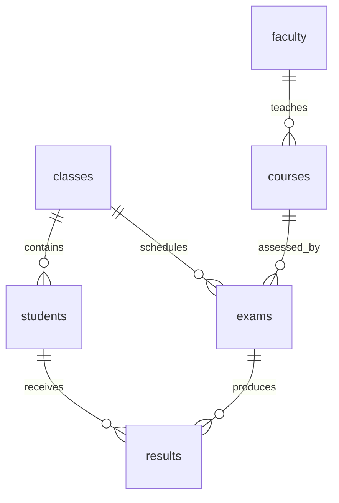

# Simple college database

Files for presentation and sharing:

- [Complete create, insert, and display queries (.txt)](college_queries.txt)
- [Relationship diagram (.png)](college_relationships.png)
- [Scalable relationship diagram (.svg)](college_relationships.svg)

The complete TXT creates a separate `college_demo` database. To display the
existing application database, run `USE college;` followed by sections 4 onward.

This is the current design for `college`, replacing the earlier 15-table
`college_v2` proposal. It follows the supplied picture with **six academic
tables, exactly 15 synthetic records per table, and six foreign keys**.

| Table | Columns | Records |
| --- | --- | ---: |
| `students` | student_id, srn, student_name, address, phone, email, class_id | 15 |
| `faculty` | faculty_id, faculty_name, designation, qualification, experience | 15 |
| `courses` | course_id, course_name, credits, faculty_id | 15 |
| `classes` | class_id, class_name, semester | 15 |
| `exams` | exam_id, exam_name, class_id, course_id, exam_date | 15 |
| `results` | result_id, student_id, exam_id, marks | 15 |

Every table has an entity-specific primary key. For example, students use
`student_id` and courses use `course_id`; foreign keys use the matching parent
key name. Names are also entity-specific, so there is no generic `name` column:
`student_name`, `faculty_name`, `course_name`, `class_name`, and `exam_name`.
The student SRN, student email, class name, and course name are unique. The same student cannot have two results
for the same exam. Marks are out of 100 and must be between 0 and 100.

## How the tables connect



All six relationships use ordinary single-column foreign keys. There are no
programs, terms, offerings, teaching-assignment tables, or prerequisite chains.

Two adjustments make the reference picture consistent:

- A class is a student group such as CSE-3A. It has a semester and can have exams
  in different courses. Faculty is assigned to a course. Linking a student's
  only class directly to a single course would otherwise restrict that student
  to just one course.
- Marks belong in the sixth table, `results`, linked to both a student and an
  exam. An exam alone cannot hold different students' marks. The exam's semester
  is available through its class instead of being duplicated.

Four small database triggers prevent entering marks for another class's exam
or changing a student/exam class in a way that invalidates existing results.
Referenced rows cannot be deleted while they still have dependent records.

This deliberately models the current set of classes. It does not provide
historical class transfers, course enrollment history, or co-teaching.

## Example questions supported by the application

- Show students
- Show student name and email from students
- Show courses and faculty
- Show student name and class name
- Show students in class CSE-3A
- Show students in semester 3
- Count students by class
- Show students with marks above 80
- Show students with marks between 60 and 80
- Show the marks secured by Meera from students
- Show marks obtained by Meera Rao from students
- Show top 5 results with highest marks
- Average marks per student
- Average marks per course
- Show students without results
- Show faculty without courses
- Show faculty with experience above 10
- Show the faculties with PhD in Mathematics
- Show faculty with MTech in Computer Science and experience above 5

The query planner uses a bounded grammar and rejects unsupported questions.
Marks refer to exam results; a student can have several results. Averages exclude
missing results instead of treating them as zero. Ask for top **results** to rank
individual exam scores. Counts by class include classes with zero students.
Named marks questions accept "secured by", "scored by", "obtained by",
"earned by", "for", and "of". A single name such as Meera matches that whole
name or the first word of a full name (Meera Rao, but not Meeran). A full name
matches exactly, ignoring case. All matching students and recorded exam scores
are returned, with the full student name beside each mark.
Faculty qualification filters accept a degree with an optional subject, such as
"PhD in Mathematics" or "MTech Computer Science". Degree punctuation and case
are ignored (Ph.D. and PhD match); the subject must match exactly. A degree
without a subject matches that degree in any subject. Use AND to combine it
with another filter, such as experience above 10.
Courses associated with a class are represented through its scheduled exams;
this is not a separate course-enrollment system.

Simple single-table queries still support the existing refinement feature.
Joined queries must be rephrased as a new question, as before.

## Authentication and backup

Existing login accounts and password hashes are preserved in the separate
`college_auth.app_users` table, selected by `DB_AUTH_NAME` in `backend/.env`.
This keeps the academic database at exactly six tables and preserves logins.
No artificial login accounts are added to meet the academic row requirement.

Both original databases were exported before replacement. Their dumps were
restored into temporary databases and compared by table definitions, full-row
hashes, and row counts. Local backups are stored under `database/backups/` and
excluded from Git because they include existing authentication records.

`schema.sql` and `seed.sql` are the reproducible academic schema and 90 rows.
To load them manually, first select a **new empty database** in MySQL, then run
the schema followed by the seed file. Do not run them over the populated app DB.

The scripts used for the reset are deliberately staged:

```powershell
.\backend\.venv\Scripts\python.exe database\college_simple\manage.py backup
.\backend\.venv\Scripts\python.exe database\college_simple\manage.py stage
.\backend\.venv\Scripts\python.exe database\college_simple\verify.py
.\backend\.venv\Scripts\python.exe database\college_simple\verify_app.py
.\backend\.venv\Scripts\python.exe database\college_simple\manage.py replace
```

These are an audit of the completed one-time reset, not instructions to rerun
it casually. Replacement requires unchanged verified backups and the verified
staging fixture. It preserves authentication, replaces `college`, and removes
`college_v2` and staging. The script attempts to restore the old college dump if
loading the replacement fails.

Recheck the final database or run the application tests:

```powershell
.\backend\.venv\Scripts\python.exe database\college_simple\verify.py --database college
.\backend\.venv\Scripts\python.exe -m unittest discover -s backend\tests
```

`verification.json` records the current MySQL checks and generated example SQL.
`app_verification.json` records the staged login, query, refinement, and admin API
checks. Legacy tests still verify the old planner on isolated fixtures; the live
application selects the six-table planner from the actual database schema.
