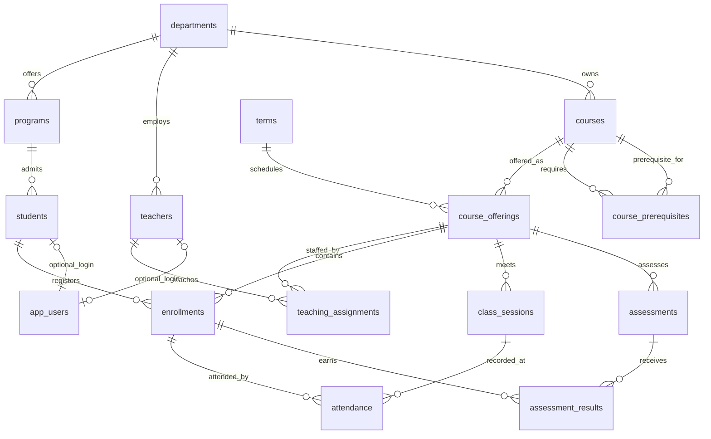

# College database redesign

> Superseded by [the simple six-table design](../college_simple/README.md).
> The `college_v2` database has been retired after a verified backup. The notes
> and verification below describe the earlier proposal, not the current app.

The separate `college_v2` database is a reviewable replacement for the current
`college` database. It contains **14 academic tables plus `app_users`**, synthetic
academic data, and no login accounts. The Flask app still points to `college`.
No original tables, rows, credentials, or application code were changed by setup.

## What the inspection found

The original database already has foreign keys, but several concepts are missing
or ambiguous:

- `students.marks` cannot describe different results in different courses.
- `students.attendance` duplicates a summary of separate attendance records,
  without defining the relevant course, term, or denominator.
- `students.subject` and `employees.department` are free text instead of links
  to the academic structure. `employees` has no relationship to the other tables.
- `courses.teacher_id` treats a teacher as a permanent property of a course,
  preventing different teachers by term/section or co-teaching.
- `enrollments` links students directly to the course catalog, with no term,
  section, or uniqueness constraint for a student's registration.
- `attendance` links students and courses separately. Its foreign keys do not
  require the student to be enrolled, or prevent duplicate attendance entries.

These are structural findings, not a claim that every existing row is invalid.

## Tables and relationships

| Table | Represents | Key relationships |
| --- | --- | --- |
| `departments` | Academic departments | Parent of programs, teachers, and catalog courses |
| `programs` | Degrees such as BTech Computer Science | Each belongs to one department |
| `students` | Student identity and home program | Each belongs to one program |
| `teachers` | Teaching staff | Each belongs to one home department |
| `courses` | Course catalog | Each belongs to one owning department |
| `terms` | Academic periods with start/end dates | One term contains many offerings |
| `course_offerings` | A course in a specific term and section | Unique course + term + section |
| `teaching_assignments` | Teachers assigned to offerings | Teacher-to-offering many-to-many |
| `enrollments` | Student registrations | Student-to-offering many-to-many |
| `course_prerequisites` | Required prior courses | Recursive course-to-course many-to-many |
| `class_sessions` | Individual classes | Belong to one offering |
| `attendance` | One student's attendance at one session | Must match both session and enrollment |
| `assessments` | Quizzes, exams, assignments, projects | Belong to one offering |
| `assessment_results` | Student score for one assessment | Must match both assessment and enrollment |
| `app_users` | Application login accounts | Optional unique link to a student OR teacher |



The crucial distinction is **course versus offering**: Database Management
Systems is one catalog entry; its 2026-ODD section A and section B are separate
offerings with separate teachers, enrollments, sessions, and scores.

Composite primary keys make the scope explicit:

- Enrollment: `(offering_id, student_id)`.
- Session: `(offering_id, session_no)`.
- Assessment: `(offering_id, assessment_no)`.
- Attendance: `(offering_id, session_no, student_id)`.
- Result: `(offering_id, assessment_no, student_id)`.

Both attendance and results reference enrollment using **both** offering and
student. A valid student from another section cannot accidentally receive this
section's attendance or marks. Session and assessment numbers are local to each
offering; there are no duplicated department names, age values, or student-level
marks and attendance summaries in the academic tables.

## Deliberate scope and query meanings

- A student's home department comes through their program. A course's owning
  department is separate. Cross-department study and teaching are allowed.
- A student can repeat a course in a later term. Duplicate registration in the
  **same offering** is blocked. Program-transfer history is outside this version.
- Age is calculated from date of birth. A term is a dated academic period, not
  a student's progress counter such as "semester 5".
- Scores are percentages from 0 to 100 per assessment. This demo uses equal
  assessment weights. It does not claim to implement institutional GPA policy.
- A final offering score requires a result for every defined assessment.
  Missing results remain missing; an explicit zero is valid.
- Recorded attendance is `(present + late) / (present + late + absent) * 100`.
  Excused and unrecorded attendance are excluded. No eligible records means NULL,
  not 0%. This policy can be changed explicitly when adapting the NLP layer.
- Withdrawn enrollments remain as history and are excluded from active counts.
- `app_users` is separate from academic queries. Existing login accounts can be
  copied with their existing password hashes at cutover; old student IDs must
  not automatically be mapped to unrelated synthetic students.
- Non-teaching employee management is omitted because it does not contribute
  to the selected academic project scope.

The database enforces keys, references, uniqueness, score ranges, allowed status
values, date ordering within a row, and no direct self-prerequisite. Deletes of
referenced academic records are restricted to protect history.

**Business rules still needed in the future write layer:** prerequisite-cycle
detection, prerequisite completion, capacity under concurrent enrollments,
one active section of a course per student per term, timetable conflicts, and
session/assessment/enrollment dates consistent with term and enrollment history.
These involve multiple rows and need transaction-aware application validation or
carefully designed triggers. They are not enforced by the current DDL. The demo
checks capacity and term-date consistency for its seeded records.

The implementation uses MySQL's documented [foreign key constraints](https://dev.mysql.com/doc/refman/8.0/en/create-table-foreign-keys.html).
Cross-row rules cannot be implemented with a simple [CHECK constraint](https://dev.mysql.com/doc/refman/8.0/en/create-table-check-constraints.html).

## Why this is enough for the project

`examples.sql` contains ten working reference queries, including:

1. Students in a course by term and section: five-table join.
2. Home-department student counts including empty departments: outer joins.
3. Cross-department study: eight-table join with two meanings of department.
4. Attendance below 75%: aggregation, explicit denominator, HAVING.
5. Top three score ranks per offering: CTEs and a window function with ties.
6. Teachers with no current assignments: NOT EXISTS.
7. Co-taught offerings: many-to-many aggregation.
8. Students who have never enrolled: anti-join logic.
9. Direct and indirect prerequisites: recursive CTE.
10. Offering counts including zero students: aggregate before joining to avoid
    multiplying counts through additional relationships.

These are **reference SQL capabilities**, not a claim that the current NLP
parser already understands these questions or this schema.

## Files and reproducibility

- `schema.sql`: all 15 CREATE TABLE statements, in dependency order.
- `setup.py`: creates a fresh candidate and seeds deterministic synthetic data.
- `examples.sql`: ten readable natural-language questions and reference SQL.
- `verify.py`: SQL behavior checks and rejected-write probes, rolled back.
- `verification.json`: timestamped MySQL verification results and row counts.

From the repository root in PowerShell:

```powershell
.\backend\.venv\Scripts\python.exe database\college_v2\setup.py --database college_v2
.\backend\.venv\Scripts\python.exe database\college_v2\verify.py --database college_v2
```

The candidate now exists, so rerunning setup with the same name deliberately
fails. Use a fresh name such as `college_v2_review` to reproduce it separately.
The verifier checks this exact demo fixture and refuses to probe the database
configured as the active app database. Neither script changes `backend/.env`,
copies real records, drops databases, or disables foreign-key enforcement.
Setup requires CREATE DATABASE privileges and MySQL 8.0.16 or later. MySQL DDL
auto-commits: if setup fails midway, it leaves the new partial schema for
inspection and rolls back any uncommitted seed inserts.

## Application migration and eventual retirement of college

Changing only `DB_NAME` would break the application. The required migration is:

1. Review this schema and query meanings with the project guide.
2. Back up the original schema and data, including existing `app_users`, and
   verify a restore into a separate database before any destructive retirement.
3. Update `backend/mappings.py` to the new vocabulary and relationships. Its
   current allowlist excludes new tables; joins must account for composite keys.
4. Update the query planner, relationship filters, and refinement logic to use
   offerings, enrollment-scoped scores, and session attendance. Ask for a term
   or state an explicit interpretation when a question is ambiguous.
5. Update schema metadata to expose primary and foreign keys. The current
   schema service returns columns only.
6. Update admin operations and frontend forms to support actual primary keys,
   including composite keys. Current update/delete paths assume a column `id`.
   Protect all key columns and add the business validations described above.
7. Replace old fixtures and reference queries, then test generated SQL against
   independent expected results, including ties, empty groups, missing marks,
   co-teaching, withdrawn students, and repeated courses across terms.
8. Preserve verified login accounts/password hashes, verify authentication and
   admin actions, then switch `DB_NAME` and restart the backend.
9. Keep the original database for rollback. Permanently dropping it is a
   separate destructive step after successful cutover and verified backup.

Status: the database candidate and SQL examples are implemented and verified.
Application migration, original-data migration, backup/restore validation, and
destructive retirement have **not** been performed.
